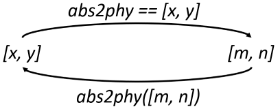
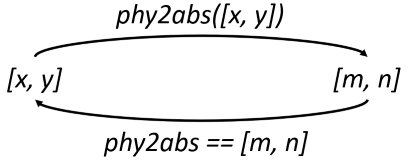
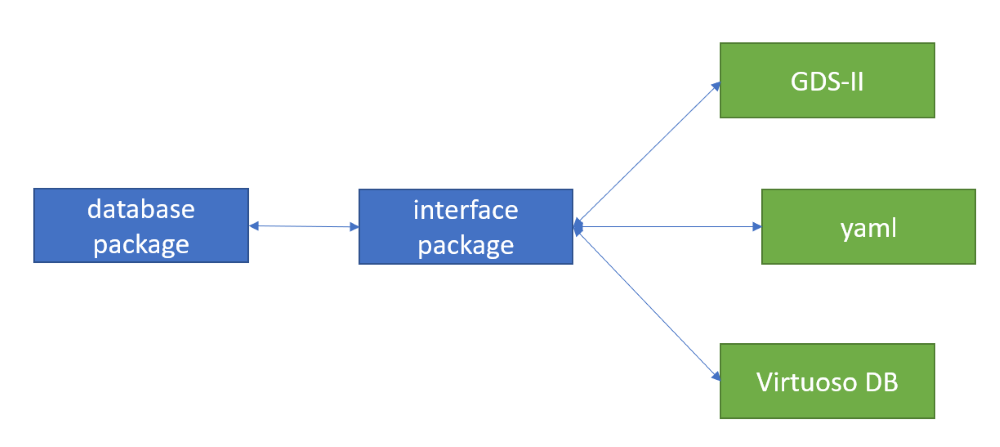

# Structure

laygo2 is composed of the following three sub-packages.
* **[object](#object-package)** package implements various physical and abstract objects that compose layouts.
* **[interface](#interface-package)** package handles various interactions between laygo2 and external objects 
(EDA tools, data structures, files).
* **[util](#util-package)** package contains useful functions for other sub-packages.

Brief explanations on the sub-packages can be found in the following sections, 
and check the API reference for details on key classes and functions.

## object package
The object package includes various classes for physical and abstract objects
([API reference link](https://laygo2.github.io/laygo2.object.html)).

The folowing modules compose the object package:

* **[physical](#physical-module)** module is defining classes for physical objects that compose actual IC layout.
* **[template](#template-module)** module describes classes for templates that generate various 
instance objects for target technology and design parameters.
* **[grid](#grid-module)** module describes grid classes to abstract placement and routing coordinates.
parameterizations.
* **[database](#database-module)** module implements classes for design hierarchy management.

The following figure illustrates a UML diagram of the object package.

### physical module
The physical module implments classes for physical layout objects
([API reference link](https://laygo2.github.io/laygo2.object.physical.html)).

Here are the summary of classes in the physical module:

* **[PhysicalObject](https://laygo2.github.io/laygo2.object.physical.PhysicalObject.html#)** is the base class for physical objects.
* **[IterablePhysicalObject](https://laygo2.github.io/laygo2.object.physical.IterablePhysicalObject.html)**(PhysicalObject) is the base class for 
'iterable' physical objects (such as arrays and groups).
* **[PhysicalObjectGroup](https://laygo2.github.io/laygo2.object.physical.PhysicalObjectGroup.html)**(IterablePhysicalObject) is a dedicated class for 
groups of physical objects (not implemented yet).
* **[Rect](https://laygo2.github.io/laygo2.object.physical.Rect.html)**(PhysicalObject) is for rect objects.
* **[Path](https://laygo2.github.io/laygo2.object.physical.Path.html)**(PhysicalObject) is for path objects.
* **[Pin](https://laygo2.github.io/laygo2.object.physical.Pin.html)**(IterablePhysicalObject) is for pin objects.
* **[Text](https://laygo2.github.io/laygo2.object.physical.Text.html)**(PhysicalObject) is for text objects.
* **[Instance](https://laygo2.github.io/laygo2.object.physical.Instance.html)**(IterablePhysicalObject) is for instances.
* **[VirtualInstance](https://laygo2.github.io/laygo2.object.physical.VirtualInstance.html)**(IterablePhysicalObject) is for virtual instances 
(a group of objects that acts as a single instance).

The following figure illustrates examples of the physical objects from one of the classes.

### template module
template module is composed of classes that abstract instances and virtual instances.
([API reference link](https://laygo2.github.io/laygo2.object.template.html)).

Here are the summary of classes in the template module:

* **[Template](https://laygo2.github.io/laygo2.object.template.Template.html)** is the basic templates class.
* **[NativeInstanceTemplate](https://laygo2.github.io/laygo2.object.template.NativeInstanceTemplate.html)**(Template) is a template class that generates Instance 
objects.
* **[ParameterizedInstanceTemplate](https://laygo2.github.io/laygo2.object.template.ParameterizedInstanceTemplate.html)**(Template) 
generates ParameterizedInstance objects with its user-defined bbox function. 
* **[UserDefinedTemplate](https://laygo2.github.io/laygo2.object.template.UserDefinedTemplate.html)**(Template)
generates VirtualInstance objects with its bbox / pins / generate functions.

### grid module
grid module is composed of classes that implement abstract coordinate systems that are interacting with 
technology-specific physical coordinate systems.
([API reference link](https://laygo2.github.io/laygo2.object.grid.html)).

laygo2 implements the layout designs based on the abstract coordinate system.

The grid module implements the following classes.

* **[CircularMapping](https://laygo2.github.io/laygo2.object.grid.CircularMapping.html)**: basic circular mapping class.
* **[CircularMappingArray](https://laygo2.github.io/laygo2.object.grid.CircularMappingArray.html)**(CircularMapping): a multi-dimensional circular mapping class.
* **[_AbsToPhyGridConverter](https://laygo2.github.io/laygo2.object.grid._AbsToPhyGridConverter.html)**: an abstract-to-physical coordinate converter class.
* **[_PhyToAbsGridConverter](https://laygo2.github.io/laygo2.object.grid._PhyToAbsGridConverter.html)**: a physical-to-abstract coordinate converter class.
* **[OneDimGrid](https://laygo2.github.io/laygo2.object.grid.OneDimGrid.html)**(CircularMapping): an one-dimensional grid classes
* **[Grid](https://laygo2.github.io/laygo2.object.grid.Grid.html)**: a two-dimensional grid classes.
* **[PlacementGrid](https://laygo2.github.io/laygo2.object.grid.PlacementGrid.html)**(Grid): a 2-dimensional grid class for instance placement.
* **[RoutingGrid](https://laygo2.github.io/laygo2.object.grid.RoutingGrid.html)**(Grid): a 2-dimensional grid class for wire routing.

#### CircularMapping class
CircularMapping class implements basic circular mappings (their indices extend to the entire axis with cyclic mapping).
The following code block shows several examples of using CircularMapping objects.

    >>> map = CircularMapping(elements=[100, 200, 300])
    >>> print(map[0])
    100
    >>> print(map[2])
    300
    >>> print(map[4])
    200
    >>> print(map[-3])
    100
    >>> print(map[[2, 3, -2])
    [300, 100, 200]
    >>> print(map[2:7])
    [300, 100, 200, 300, 100]
    

#### _AbsToPhyGridConverter class
_AbsToPhyGridConverter is an internal class that converts abstract coordinates to physical coordinates. 
It also supports reverse conversions (physical-to-abstract) with comparison operators 
(which requires its pair converter class, _PhyToAbsGridConverter defined in its master grid object).

#### _PhyToAbsGridConverter class
_PhyToAbsGridConverter is an internal class that converts physical coordinates to abstract coordinates.
It also supports reverse conversions (abstract-to-physical) with comparison operators
(which requires its pair converter class, _AbsToPhyGridConverter defined in its master grid object).

#### Grid class
Grid class implements an abstract coordinate that is mapped to a 2-dimensional physical coordinate system.

The Grid class and its objects support various coordinate conversion functions, with their examples introduced in the 
following figure.

 

### database module
database module consists classes that implement design hierarchy to manage designs and libraries with its component 
classes described as follows:

* **[BaseDatabase](https://laygo2.github.io/laygo2.object.database.BaseDatabase.html)** is the basic database management class.
* **[Library](https://laygo2.github.io/laygo2.object.database.Library.html)**(BaseDatabase) is the library management class.
* **[Design](https://laygo2.github.io/laygo2.object.database.Design.html)**(BaseDatabase) is the design management class.

([API reference link](https://laygo2.github.io/laygo2.object.database.html)).

## interface package
interface package includes classes and functions that interact with laygo2 and external EDA tools or data structures.
([API reference link](https://laygo2.github.io/laygo2.interface.html)).

* **gds module** contains various functions to store the layout structures in GDS-II format, which is the most popular 
format to store layout structures.
* **yaml module** contains various I/O functions to express designs in yaml format.
* **virtuoso module** contains various functions that interacts with Cadence Virtuoso using Skill language.

## util package
util package contains various functions used in other packages.

