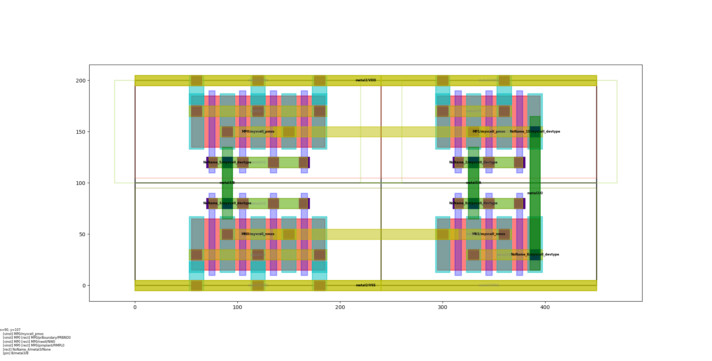

# Trial

This document introduces setup procedure and trial example for begineers.

<!--
* **[Quick installation and setup](#Quick-Installation-and-Setup)** describes the installation and set up procedure of 
laygo in linux environments.
* **[Technology setup](#Technology-Setup)** illustrates how to set up laygo2 for new technology nodes.
* **[simple-gates](#Simple-Gates)**: introduces layout generators for simple logic gates.
-->

## Colab tutorial

The easiest way of exercising laygo2 without installing it locally is using Colab; 
the example tutorial can be found [here](https://colab.research.google.com/drive/1tpuUvqb6BujzZI6RBf2cFdAfMqBsxpep?usp=sharing).

## Installation 

There are two ways of installing laygo2 in your environment; 1) cloning from github and 2) using pip.

### Installing laygo2 from [Github](https://github.com/niftylab/laygo2.git)

Users can download and install the laygo2 package by cloning its github 
repository by typing the following command:

    >>>> git clone https://github.com/niftylab/laygo2.git

It is highly recommended that the following command is used periodically to maintain the code to the latest version.

    >>>> git pull origin master

After that, update the PHTHONPATH environment variable to point out the laygo2 package path for importing.

    # (csh/tcsh example) add the following command to your .cshrc
    setenv PYTHONPATH ${PYTHONPATH}:[LAYGO2_INSTALLATION_PATH]/laygo2

### Installing laygo2 from [Pypi](https://pypi.org/project/laygo2) 

Instead of cloning github repository, laygo2 package can be installed by running the following pip command:

    >>>> pip install laygo2

## Technology setup

Users need to set up the following files in the **laygo_tech** directory to enable laygo2 for a new technology:

    laygo2_tech_templayes.py  # for templates
    laygo2_tech_grids.py      # for grids
    laygo2_tech.yaml          # for technology parameters

A bare-minimum tech setup for quick_start.py can be found [here](https://github.com/niftylab/laygo2/tree/master/laygo2/examples/laygo2_tech).
A more complete tech setup example for **gpdk045** can be found [here](https://github.com/niftylab/laygo2_workspace_gpdk045/tree/master/laygo2_tech_example).

## Simple gate generation

Running the following command will generate a NAND gate layout.

    (after git clone)
    >>>> cd laygo2 
    >>>> python -m quick_start.py
    (or you can run ipython and type run 'quick_start.py' instead)
    
The resulting layout of the NAND gate is shown in the figure below:

